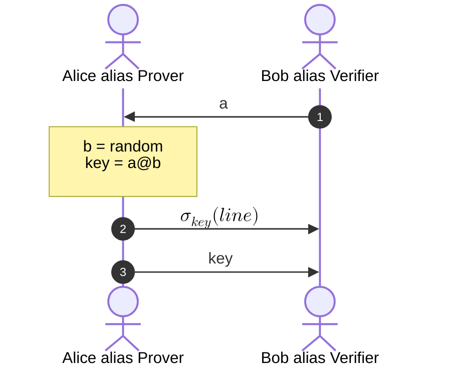

<!-- jump_to_middle -->

Intuition
===

<!-- end_slide-->

Dragibus
===

<!-- end_slide -->

Sudoku
===

```python +exec +line_numbers
/// import sys
/// sys.path.append('/home/bleroux/Documents/forma-zkp/')
/// 
/// from random import seed
seed(73)

from sudoku import *

print_board(board)
```

<!-- end_slide-->

Sudoku
===

```python {5-7|9-11} +exec +line_numbers
/// import sys
/// sys.path.append('/home/bleroux/Documents/forma-zkp/')
/// 
/// from random import seed, sample 
/// from time import sleep
/// shuffle = lambda x: sample(x, len(x))
seed(73)

from sudoku import *

# P ask for verification of the line 3
# V send a shuffled version of line 3 of his solution
line = shuffle(solution[2])

# P verify that the constraints are respected
print(line)
print(all(line.count(n) == 1 for n in range(1, 9)))
```
<!-- 
speaker_note: |
    Pb1: peut-etre que V peut remonter à des infos si il sait comment shuffle est implémenté
    Pb2: un ordi ne peut pas suivre du regard les données que P lui envoit, il ne peut pas s'assurer de la provenance des données que P envoit
-->

<!-- end_slide-->

Sudoku
===



<!-- end_slide -->

<!-- jump_to_middle -->

Formalisme
===

<!-- end_slide -->

Machine de Turing
===

# Qu'est-ce qu'un Algorithme ?

<!-- end_slide -->

Prove Me Wrong
===

# Qu'est-ce qu'une *Preuve* ?

<!-- pause -->
<!-- incremental_lists: true -->

- Preuve en Maths
- Preuve en Science
- En droit pénal (L'accusation doit prouver son cas "au-delà de tout doute raisonnable")
- En info, c'est ...

<!-- pause -->

# Définition


<!-- 
speaker_note: |
    En *Science* on parle de signification statistique.
-->

<!-- end_slide -->

ZKP
===

# Définition 1

```typst +render
Un système de preuve interactif $(A,B)$ de connaissance du prédicat $P(I,S)$ est dit *à divulgation nulle de connaissance* \
si pour tout vérifieur $tilde(B)$, la famille de variables aléatoires $#text[Vue]_(A,tilde(B))(I,H)$ est parfaitement approximable sur \
$cal(L) = { (I,H)|I in L #text[ et] |H| lt.eq |I|^k }$ pour tout entier $k$ fixé.
```

<!-- end_slide-->

<!-- jump_to_middle -->

Exemples
===

<!-- end_slide -->

ZK-QR
===

<!-- end_slide -->

ZK-HAM
=== 

<!-- end_slide -->

<!-- jump_to_middle -->

Applications
=== 

<!-- end_slide -->

<!-- column_layout: [3, 2, 3] -->


<!-- column: 0 -->

```bash +exec_replace
pokemonsay --think "Oui !"
```
```bash +exec_replace
pokemonsay --think "Oui !"
```

<!-- column: 1 -->

```bash +exec_replace
pokemonsay "Des questions ???" 
```

<!-- column: 2 -->

```bash +exec_replace
pokemonsay --think "Oui !"
```
```bash +exec_replace
pokemonsay --think "Oui !"
```

<!-- end_slide -->

Références
===

# Vidéos

- [Wired](https://www.youtube.com/watch?v=fOGdb1CTu5c&t=1145s)
- [Up and Atom](https://www.youtube.com/watch?v=V5uVKZn3F_4)
- [Passe-Science](https://www.youtube.com/watch?v=OSdcnoAmohs)

# Papiers

# Lien Randoms

- [Pages wikipédia (fr et en)](https://en.wikipedia.org/wiki/Zero-knowledge_proof)
- [Cours ENS](https://www.di.ens.fr/~granboul/enseignement/crypto/MPRI1-Crypto-ZeroKnowledge.pdf)
- [Cours ENS (bis)](https://www.irif.fr/~carton/Enseignement/Complexite/ENS/Redaction/2009-2010/ludovic.patey.pdf)
- [TD ENS](https://www.di.ens.fr/brice.minaud/cours/2018/TD4.pdf)
- [Cours du MIT](https://courses.csail.mit.edu/6.857/2018/files/L22-ZK-Boaz.pdf)

# Lien vers la présentation

- [Repo github](https://github.com/benoitlx/forma-zkp)
- [Drive Rézo](#todo)
