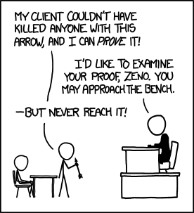

<!-- jump_to_middle -->

Intuition
===

<!-- end_slide-->

Dragibus®
===


<!-- pause -->

Trouvez un protocol me permettant de prouver que j'ai choisis des `bonbons` de différentes couleurs, sans que vous puissiez savoir lesquels.

<!-- end_slide -->

Sudoku
===

```python +exec +line_numbers
/// import sys
/// sys.path.append('/home/bleroux/Documents/forma-zkp/')
/// 
/// from random import seed
seed(73)

from sudoku import *

print_board(board)
```

<!-- end_slide-->

Sudoku
===

```python {5-7|9-11} +exec +line_numbers
/// import sys
/// sys.path.append('/home/bleroux/Documents/forma-zkp/')
/// 
/// from random import seed, sample 
/// from time import sleep
/// shuffle = lambda x: sample(x, len(x))
seed(73)

from sudoku import *

# P ask for verification of the line 3
# V send a shuffled version of line 3 of his solution
line = shuffle(solution[2])

# P verify that the constraints are respected
print(line)
print(all(line.count(n) == 1 for n in range(1, 9)))
```
<!-- 
speaker_note: |
    Pb1: peut-etre que V peut remonter à des infos si il sait comment shuffle est implémenté
    Pb2: un ordi ne peut pas suivre du regard les données que P lui envoit, il ne peut pas s'assurer de la provenance des données que P envoit
-->

<!-- pause -->
```typst +render
#figure(
  image("../assets/74.jpg"),
  caption: [xkcd: 74],
)
```

<!-- end_slide-->

Kururugi Sudoku
===


<!-- end_slide -->

<!-- jump_to_middle -->

Formalisme
===

<!-- end_slide -->

Algo quoi ??
===

# Qu'est-ce qu'un Algorithme ?

<!-- pause -->

> Algorithm does not have a generally accepted formal definition. Researchers[1] are actively working on this problem.

[From](https://en.wikipedia.org/wiki/Algorithm_characterizations)

<!-- pause -->

Pleins de modèle de calcul différents :
<!-- incremental_lists: true -->
- automate fini
- automate à pile
- lambda-calcul
- machines à registres
- automates cellulaires
- **Machine de Turing**

<!-- pause -->

# Définition 1 - Machine de Turing

```typst +render
Une *machine de Turing* est un 7-uplet $(Sigma, Q, sigma, delta, Delta, q_0, F)$ où :
- $Sigma$ est un ensemble de symboles appelé alphabet, avec un symbole particulié noté $\#$.
- $Q$ est un ensemble non vide fini d'états.
- $sigma : Q times Sigma arrow.r.long Sigma$ est une fonction d'*impression*.
- $delta: Q times Sigma arrow.r.long Q$ est une fonction de *transition*.
- $Delta: Q times Sigma arrow.r.long {-1, 1}$ est une fonction de *déplacement*.
- $q_0$ l'état initial de la machine.
- $F$ l'ensemble des états finaux.
```

<!-- pause -->

## [Fonctionnement](https://turingmachine.io/)

```typst +render
À chaque étape, la machine se trouve dans un état $q$ et lit un symbole $a$, puis suit les instructions suivantes :
- écrit le symbole $sigma(q,a)$ sur le ruban.
- déplace la tête de lecture en fonction de $Delta(q, a)$.
- passe de l'état $q$ à l'état $delta(q, a)$.
```

<!-- end_slide -->

Machine de Turing interactive
===

<!-- new_lines: 10 -->


<!-- end_slide -->

Prove Me Wrong
===

<!-- column_layout: [3, 2] -->

<!-- column: 0 -->
# Qu'est-ce qu'une *Preuve* ?

<!-- pause -->
<!-- incremental_lists: true -->

- en Maths => preuve comme séquence statique de symboles
- en Science => accumulation statistique de preuves
- En droit pénal => L'accusation doit prouver son cas "au-delà de tout doute raisonnable"
- En info, c'est ...

<!-- pause -->

# Définition 2 - Système de Preuve interactif

```typst +render
Soit $cal(L)$ un langage sur ${0,1}$ ($cal(L) subset.eq {0,1}^*$). \ On appel *système de preuve interactif pour $cal(L)$* \ toute paire d'*Algorithme interactif* $(P,V)$,\ avec $V$ s'exécutant en $cal(O)(n^k), k in NN$, vérifiant :
- *Complétude*: Si $x in cal(L)$ et si $P$ et $V$ interagissent sur l'entrée $x$, \ à la fin de l'interraction, $V$ retourne "Accepté" \ avec probabilité supérieur à $0.9$.
- *Robustesse*: Si $x in.not cal(L)$ alors pour tout algorithme $P^*$, \ si $P^*$ et $V$ interagissent sur l'entrée $x$, \ à la fin de l'interraction, $V$ retourne "Accepté" \ avec probabilité inférieur à $0.1$.
```

<!-- column: 1 -->

xkcd: 1153


<!-- 
speaker_note: |
    En *Science* on parle de signification statistique.
-->

<!-- end_slide -->

ZKP
===

# Définition 3

```typst +render
Un *système de preuve interactif* $(P, V)$ est dit à *divulgation nulle de connaissance* si \ pour toute stratégie de vérification efficace (s'exécute en tps polynomial) $V^*$, il existe un algorithme probabiliste efficace $S^*$, \ tel que pour tout $x in cal(L)$ les variables aléatoires suivantes sont calculatoirement indiscernable :
- La sortie de $V^*$ après interaction avec $P$ sur l'entrée $x$.
- La sortie de $S^*$ sur l'entrée $x$.
```

<!-- end_slide-->

<!-- jump_to_middle -->

Exemples
===

<!-- end_slide -->

ZK-QR
===

<!-- end_slide -->

ZK-HAM
=== 

<!-- end_slide -->

<!-- jump_to_middle -->

Applications
=== 

<!-- end_slide -->

<!-- column_layout: [3, 2, 3] -->


<!-- column: 0 -->

<!-- pause -->
```bash +exec_replace +no_background
pokemonsay "Des questions ???" 
```

<!-- column: 1 -->

<!-- pause -->
```bash +exec_replace +no_background
pokemonsay --think "Oui !"
```
<!-- pause -->
```bash +exec_replace +no_background
pokemonsay --think "Oui !"
```

<!-- column: 2 -->

<!-- pause -->
```bash +exec_replace +no_background
pokemonsay --think "Oui !"
```
<!-- pause -->
```bash +exec_replace +no_background
pokemonsay --think "Oui !"
```

<!-- end_slide -->

Meta
===

```bash +exec_replace +no_background
git pull
onefetch -T prose programming
```

<!-- end_slide -->

Références
===

# Vidéos

- [Wired](https://www.youtube.com/watch?v=fOGdb1CTu5c&t=1145s)
- [Up and Atom](https://www.youtube.com/watch?v=V5uVKZn3F_4)
- [Passe-Science](https://www.youtube.com/watch?v=OSdcnoAmohs)

# Papiers

# Lien Randoms

- [Pages wikipédia (fr et en)](https://en.wikipedia.org/wiki/Zero-knowledge_proof)
- [Cours ENS](https://www.di.ens.fr/~granboul/enseignement/crypto/MPRI1-Crypto-ZeroKnowledge.pdf)
- [Cours ENS (bis)](https://www.irif.fr/~carton/Enseignement/Complexite/ENS/Redaction/2009-2010/ludovic.patey.pdf)
- [TD ENS](https://www.di.ens.fr/brice.minaud/cours/2018/TD4.pdf)
- [Cours du MIT](https://courses.csail.mit.edu/6.857/2018/files/L22-ZK-Boaz.pdf)

# Lien vers la présentation

- [Repo github](https://github.com/benoitlx/forma-zkp)
- [Drive Rézo](#todo)

# Misc.

- [`presenterm`](https://github.com/mfontanini/presenterm)
- [`typst`](https://github.com/typst/typst)
- [`pokemonsay`](https://github.com/possatti/pokemonsay)
- [`onefetch`](https://github.com/o2sh/onefetch)
- [`mmdc`](https://github.com/mermaid-js/mermaid-cli)
